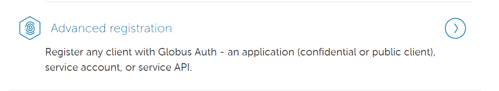
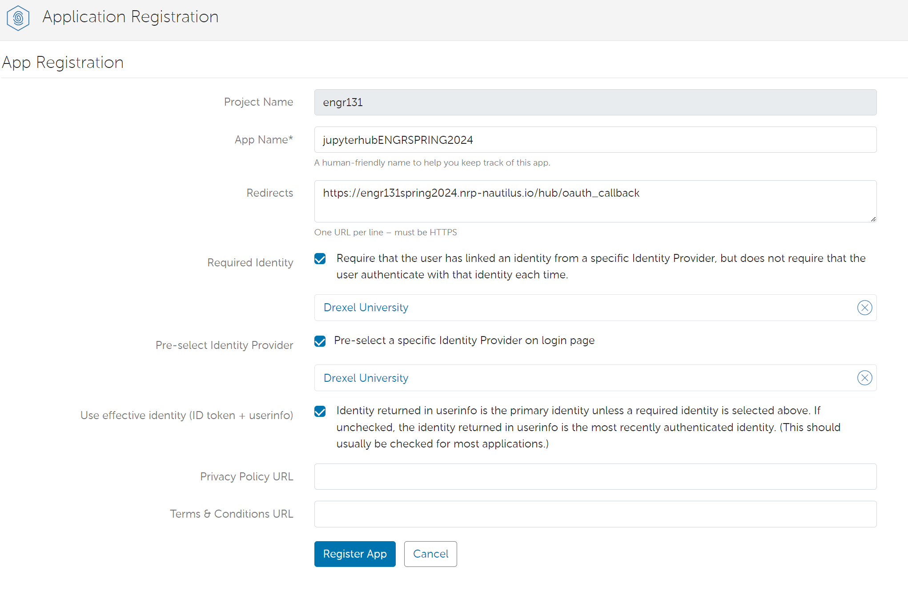
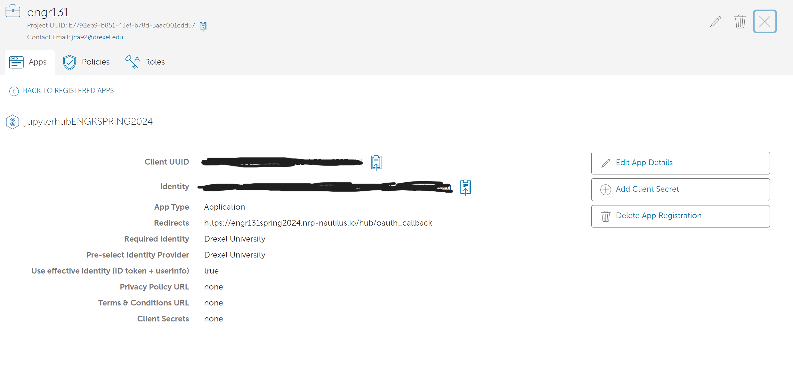
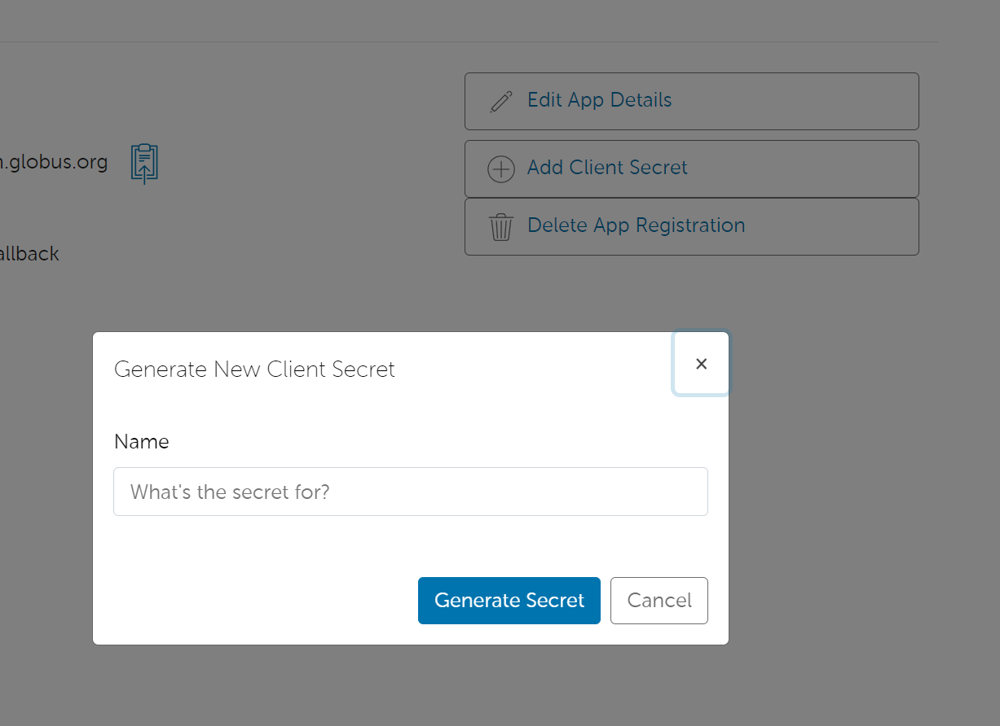
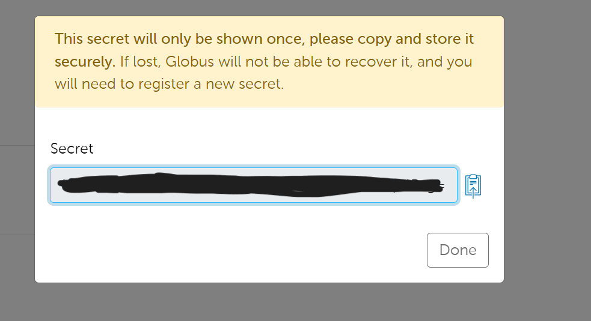

# Deploying a JupyterHub

## Introduction

JupyterHub is a multi-user Jupyter notebook server. It is a great tool for teaching and learning, as it allows students to access a Jupyter notebook environment without having to install anything on their local machine. This guide will walk you through the process of deploying a JupyterHub server on the Nautilus Research Platform.

## Authentication Provided

### Globus Auth

Globus auth allows you to use trusted authentication and authorization to access the JupyterHub server. This is the recommended method for authentication.

#### Registering your application

1. Go to the [Globus Developer Console](https://developers.globus.org/) and log in with your Globus credentials.
1. Click on settings
   
1. Click on the developers tag
   
1. Click on advanced registration
   
1. Register your application
   
   :exclamation: Make sure to add the redirect URL as `https://<your_jupyterhub_url>/hub/oauth_callback`

   Add the redirect URL to the secrets.sh file

   ```bash
   export OAUTH_CALLBACK_URL="https://<your_jupyterhub_url>/hub/oauth_callback"
   ```

1. Save your application UUID
   
   Add the application UUID to the secrets.sh file
   ```bash
   export OAUTH_CLIENT_ID="<your_application_uuid>"
   ```
1. Generate a client secret
   
   
   :exclamation: Make sure to save the client secret as it will not be shown again.
   Add the oauth secret to the secrets.sh file
   ```bash
   export OAUTH_CLIENT_SECRET="<your oauth secret>"
   ```

##### TRY 9/4/2024

helm repo add bitnami https://charts.bitnami.com/bitnami --namespace=engr131spring
helm install jupyterhub-postgresql bitnami/postgresql --set postgresqlPassword=password --namespace=engr131spring

POSTGRES_PASSWORD=$(kubectl get secret --namespace engr131spring jupyterhub-postgresql -o jsonpath="{.data.postgresql-password}" | base64 --decode)
POSTGRES_HOST=$(kubectl get svc --namespace engr131spring jupyterhub-postgresql -o jsonpath="{.spec.clusterIP}")

export envtag="2.0.0"
export course="engr131"
export semester="spring2024"
export dockeruser="jagar2"
export nrpgitlabuser="jagar2"
export envcontainer="${course}jlab"
export HOSTNAME="nrp-nautilus.io"
export OAUTH_CLIENT_SECRET="VsH4/qz0Vm+4pENMFP3j6EeyHgi4s1RPQNR7Mrp4Pxg="
export OAUTH_CALLBACK_URL="https://${course}-${semester}.${HOSTNAME}/hub/oauth_callback"
export OAUTH_CLIENT_ID="e34feab7-6074-4b9d-8122-b75ae6757e4d"
export ADMIN_USERS="jca92@drexel.edu,jca318@lehigh.edu,jca318@globusid.org,jca318"

helm repo add engr131-spring2024 https://jupyterhub.github.io/helm-chart/ && helm repo update &&
helm upgrade --cleanup-on-fail --install jhub engr131-spring2024/jupyterhub --namespace engr131spring --version=2.0.0 --values ./values.yaml

helm upgrade --cleanup-on-fail --install jhub jupyterhub/jupyterhub --namespace engr131spring --version=3.3.7 --values default.yaml

helm uninstall jhub --namespace engr131spring

helm repo add ectobit https://charts.ectobit.com && helm repo update &&
helm install pgweb ectobit/pgweb --namespace engr131 --values ./database/k8/pgweb.yml

helm uninstall pgweb --namespace engr131

kubectl create -f database/k8/pgwebv2.yml -n engr131

# Use envsubst, sed, or similar to replace placeholders in your template

envsubst < ./jupyterhub/values.template.yaml > values.generated.yaml
